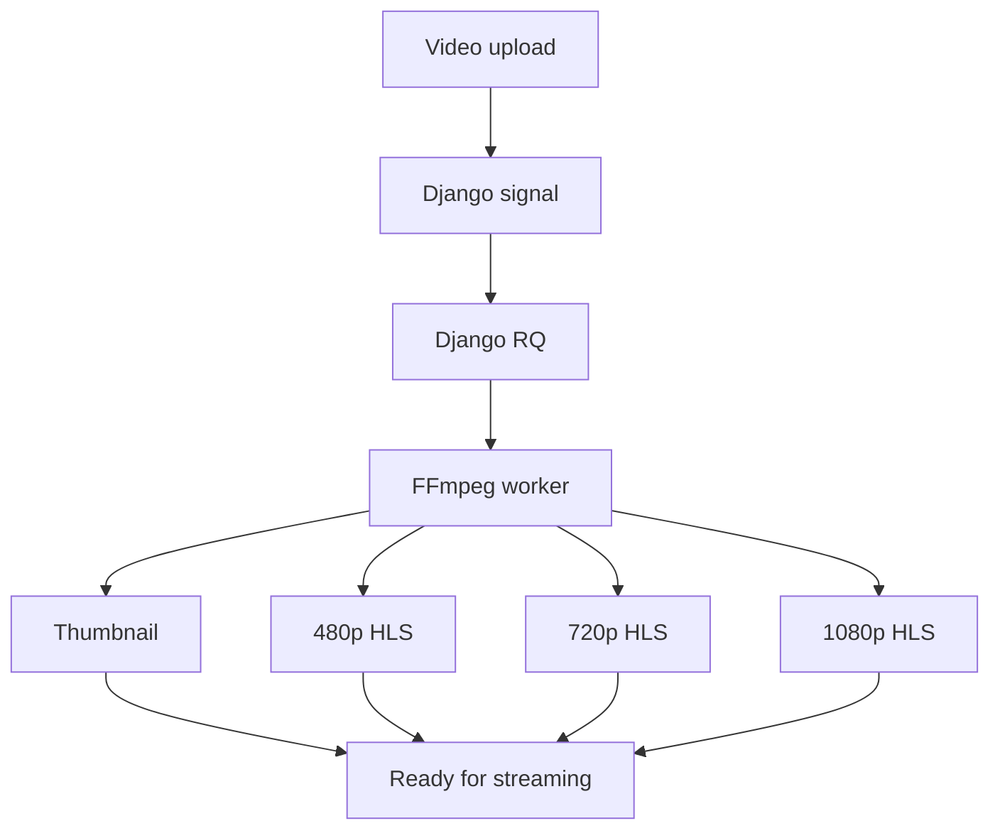

# Videoflix Backend

**Django REST backend for secure, asynchronous video processing and adaptive HLS streaming.**

[](https://www.python.org/)
[](https://www.djangoproject.com/)
[](https://www.postgresql.org/)
[](https://redis.io/)
[](https://www.docker.com/)

[**Live Demo**](https://ahmet-balci.de/projects/videoflix/) · [**Provided Frontend**](https://github.com/Developer-Akademie-Backendkurs/project.Videoflix)

Videoflix turns uploaded source videos into protected multi-resolution streams. Processing runs outside the request cycle, while authenticated users receive thumbnails, HLS manifests and video segments through the API.

> The frontend was provided by Developer Akademie. I implemented the complete backend architecture, API, authentication, email flows, caching, background processing, video transcoding, tests and production deployment.

## Engineering highlights

- **Asynchronous media pipeline:** Django RQ processes uploads without blocking API requests.
- **Adaptive streaming:** FFmpeg generates thumbnails and HLS output in 480p, 720p and 1080p.
- **Secure authentication:** JWT access and refresh tokens are stored in HttpOnly cookies.
- **Protected media delivery:** catalogue data, thumbnails, manifests and segments require authentication.
- **Efficient catalogue access:** Redis caches video lists and invalidates them when video data changes.
- **Production automation:** CI checks quality, security and tests before publishing immutable Docker images.

## How video processing works



Each video moves through `pending`, `processing`, `ready` or `failed`. Only successfully processed videos appear in the catalogue.

## Core features

### Authentication and accounts

- Registration with email and password
- Email-based account activation
- Login and logout with HttpOnly JWT cookies
- Access-token refresh
- Refresh-token blacklisting
- Password recovery by email
- Generic responses for sensitive account flows to reduce account enumeration

### Video delivery

- Video upload through Django Admin
- Background transcoding with FFmpeg
- Automatic thumbnail generation
- HLS manifests and segments for three resolutions
- Authenticated catalogue and media endpoints
- Newest-first catalogue ordering

### Reliability

- Redis-backed cache and task queue
- Automatic catalogue-cache invalidation
- Explicit processing states and failure handling
- Separate web and worker containers

## Tech stack

| Area | Technology |
| --- | --- |
| Backend | Python 3.12, Django 6.1, Django REST Framework |
| Authentication | Simple JWT, HttpOnly cookies, token blacklist |
| Database | PostgreSQL |
| Cache and queue | Redis, django-redis, Django RQ |
| Media | FFmpeg, HLS, Pillow |
| Testing | Django Test Framework, DRF APITestCase, Coverage.py |
| Delivery | Docker, Gunicorn, Nginx, GitHub Actions, GHCR |

## API overview

| Method | Endpoint | Purpose |
| --- | --- | --- |
| `POST` | `/api/register/` | Create an inactive account |
| `GET` | `/api/activate/<uidb64>/<token>/` | Activate an account |
| `POST` | `/api/login/` | Authenticate and set JWT cookies |
| `POST` | `/api/logout/` | Log out and blacklist the refresh token |
| `POST` | `/api/token/refresh/` | Refresh authentication |
| `POST` | `/api/password_reset/` | Request a password-reset email |
| `GET` | `/api/video/` | List ready videos |
| `GET` | `/api/video/<movie_id>/thumbnail/` | Retrieve a protected thumbnail |
| `GET` | `/api/video/<movie_id>/<resolution>/index.m3u8` | Retrieve an HLS manifest |
| `GET` | `/api/video/<movie_id>/<resolution>/<segment>/` | Retrieve an HLS segment |

## Run locally

```bash
git clone https://github.com/AhmetB-Dev/videoflix-backend.git
cd videoflix-backend
cp .env.example .env
docker compose up --build
```

On Windows PowerShell, create the environment file with:

```powershell
Copy-Item .env.example .env
```

The local services are available at:

- API: `http://127.0.0.1:8000/api/`
- Django Admin: `http://127.0.0.1:8000/admin/`

Use [`.env.example`](./.env.example) as the source of truth for configuration. Never commit real credentials.

## Tests and delivery

```bash
docker compose exec web python manage.py test
```

The test suite covers account flows, JWT handling, protected media access, caching, cache invalidation, email delivery, background processing and failure states.

The CI/CD pipeline:

1. runs Ruff and dependency auditing;
2. executes Django production checks;
3. runs the full test suite with a minimum coverage threshold;
4. builds and publishes one immutable production image;
5. deploys that image to the VPS.

## Security and production

- HttpOnly authentication cookies
- Refresh-token invalidation
- Authenticated-by-default API permissions
- Protected thumbnails and HLS files
- Server-side validation of requested segment paths
- Environment-driven origins, hosts and secrets
- Private PostgreSQL and Redis services
- Nginx as the public HTTPS entry point

Production details are documented in [`DEPLOYMENT.md`](./DEPLOYMENT.md).

---

Built as part of my Fullstack Developer portfolio.
